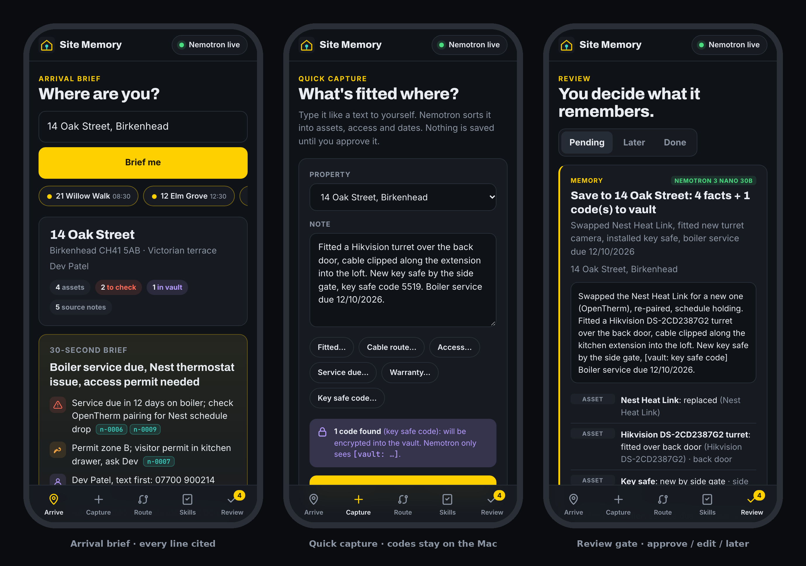
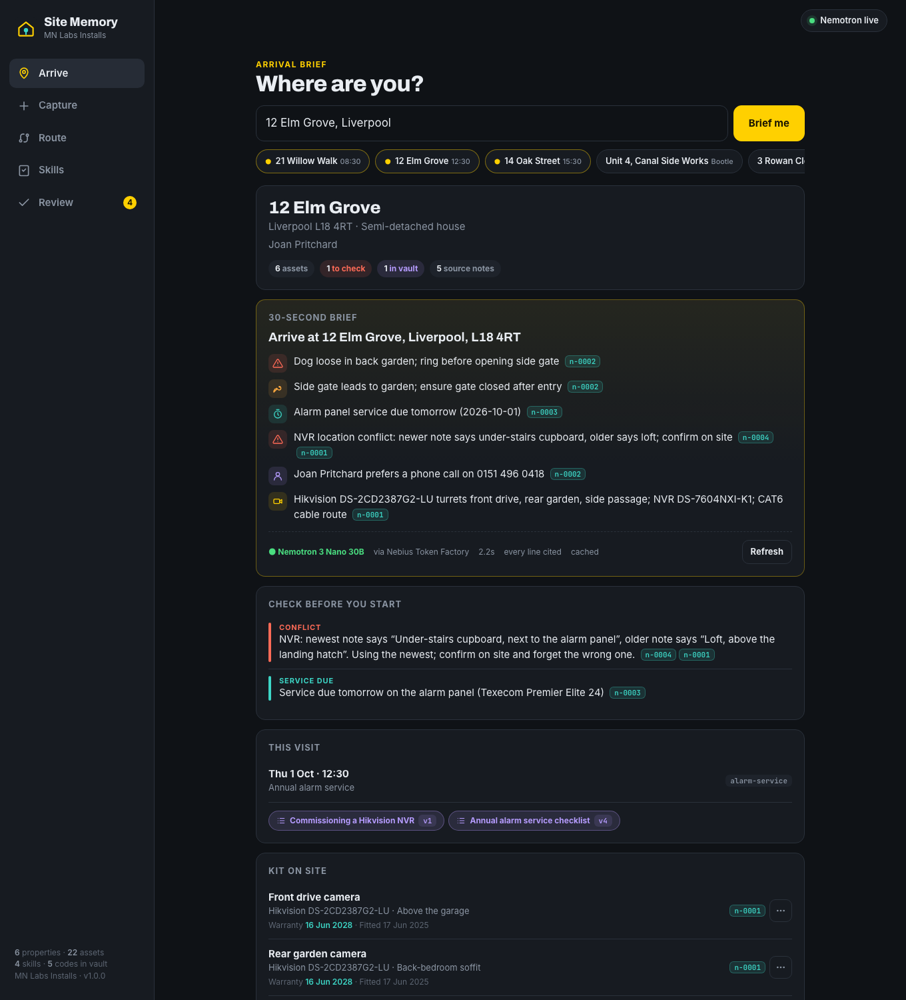
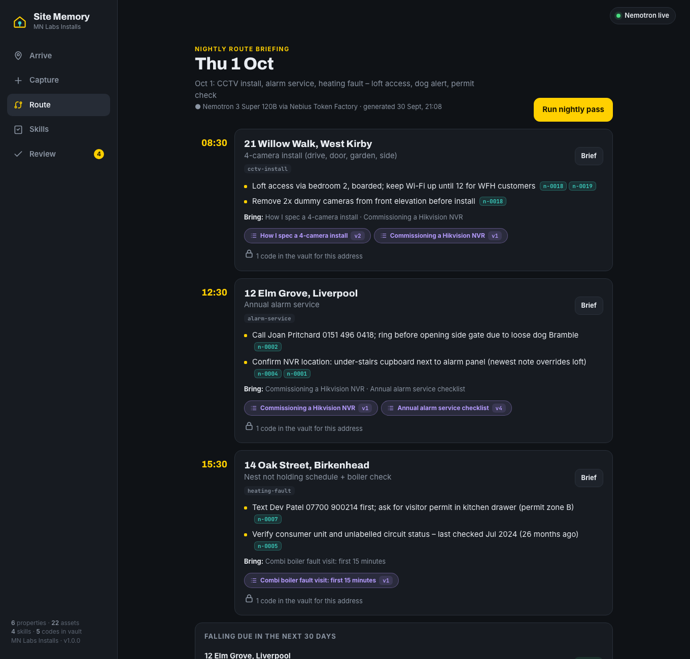
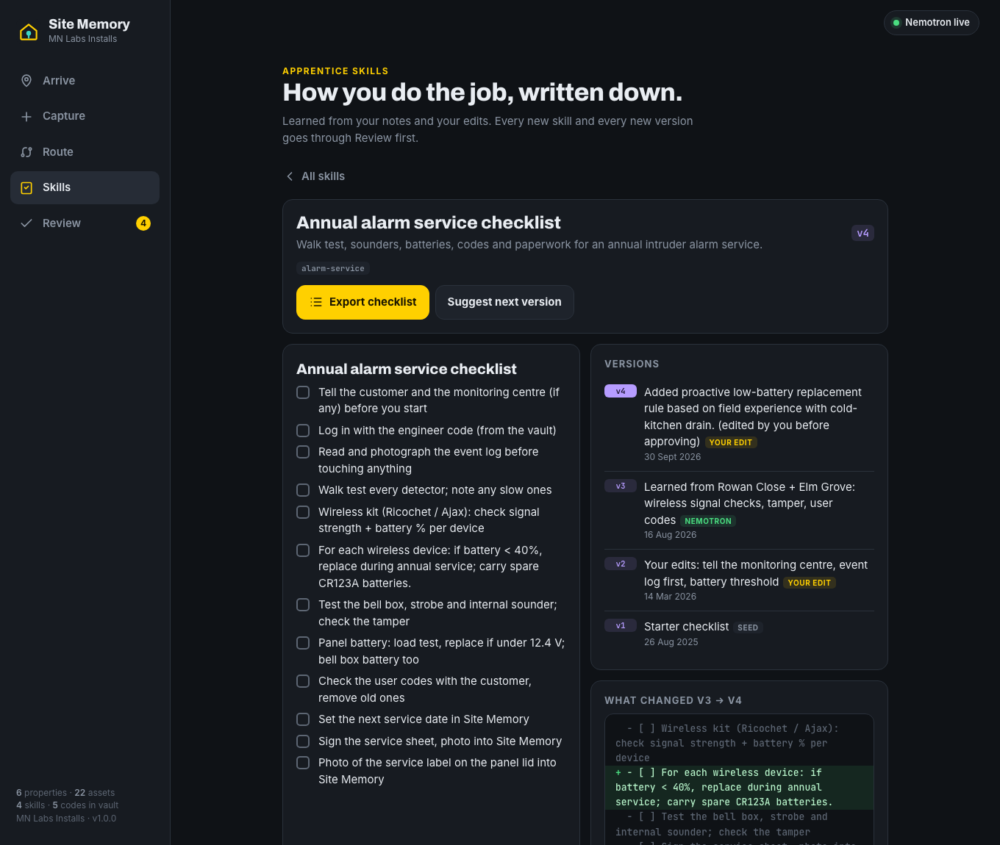
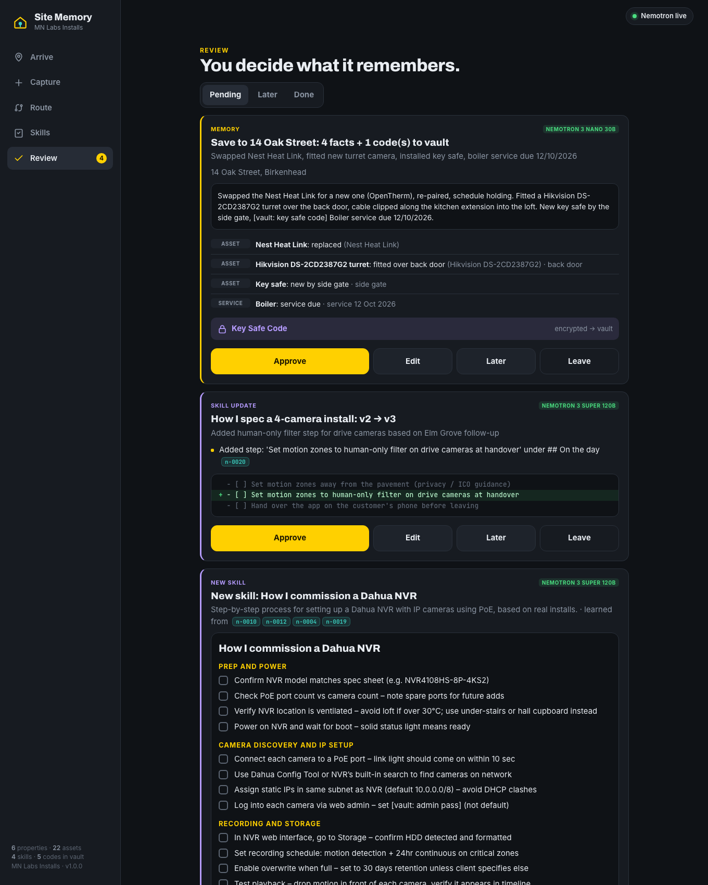

# Site Memory

[](LICENSE)


**An installer's private, always-on memory of every property, plus an apprentice that writes down how you do the job.**

Nebius × NVIDIA Global AI Hackathon 2026 · **Personal AI track** · MN Labs Ltd (Michael Napier) · MIT licence

**▶ Live demo:** _being deployed (link coming shortly)_ &nbsp;·&nbsp; **🎬 Video (under 3 min):** _coming shortly_

A one-person UK installer (CCTV, alarms, smart home, heating, electrical) carries hundreds of properties in their head: which NVR is in which loft, where the cable runs, whose dog is loose in the garden, when the boiler service falls due. And when they take on an apprentice or a sub, none of that know-how is written down. Site Memory keeps all of it on your own Mac. When you pull up outside a job and ask *"I'm at 14 Oak St, what do I need to know?"* you get a 30-second brief in which **every line links back to the note it came from**. The night before, **Nemotron 3 Super** plans tomorrow's route. And from your notes and edits it writes **Apprentice Skills**: versioned checklists your apprentice can follow.



## Why it's a Personal AI

| Personal AI track asks for | Site Memory |
|---|---|
| **Always-on, private assistant** | A local server on your own Mac (or phone on your Wi-Fi). Memory, the encrypted codes vault and its key never leave the device; codes are stripped before any AI call. |
| **Persistent memory** | Every note becomes cited facts per property (kit, access, cable routes, customer, warranty, service), with conflict and staleness detection, and **forget** / **redact** controls. Survives restarts. |
| **Reusable skills** | **Apprentice Skills**: markdown skill files learned from your notes, improved from your edits (v1 → v2 → v3 with diffs), attached to properties or job types, exported as checklists. |
| **Tasks across the day** | Morning: tomorrow's route briefing is waiting. On the doorstep: arrival brief. On the job: quick capture. Evening: the nightly pass runs itself at 20:30 on Nemotron 3 Super. |
| **Human in control** | Nothing is saved to memory or skills without **Approve / Edit / Later / Leave** in Review, and every decision is journalled. |

## What it does

1. **Property memory.** Quick text capture of what's fitted where: cameras, NVRs, alarm panels, boilers, consumer units (make, model, location), cable routes, access notes, warranty and service dates, and who the customer is. Nemotron turns the note into structured facts; each fact keeps a pointer to its source note.
2. **Secrets never reach the AI.** Alarm codes, key-safe codes, gate PINs and Wi-Fi passwords are detected **on the Mac before any AI call**, encrypted into a separate vault (Fernet) and replaced with `[vault: key safe code]`. Every outbound request is scrubbed again, and checked against every vault plaintext, before it leaves the machine.
3. **Arrival brief.** Resolves the address from a plain question and returns a cited brief. Lines that cite nothing, or that aren't supported by the cited notes, are **dropped** (a lexical grounding check). Conflicts (two notes disagree on where the NVR is), stale facts (not confirmed for 18 months) and warranties or services falling due are flagged by rules, so they always appear even if the model forgets them. Any fact can be **forgotten** or **redacted into the vault** from the brief.
4. **Nightly route briefing.** At 20:30 (configurable) **Nemotron 3 Super** reads tomorrow's jobs, each property's facts and the attached skills, and writes a prep briefing per stop, with a list of warranties and services due in the next 30 days and whether they're booked.
5. **Apprentice Skills.** From your notes and **your edits**, Nemotron proposes reusable skill files in markdown, such as "How I spec a 4-camera install", "Commissioning a Hikvision NVR" or "Annual alarm service checklist". Skills are versioned (v1 → v2 → v3, with diffs and a change note per version), attached to properties or job types, and exported as a plain checklist for a sub or apprentice (codes are never printed). What you add or remove when you edit a proposal is stored as an *edit signal* and fed into the next improvement. You can also edit the `.md` skill file directly, and Site Memory records that as a new version.
6. **Find the manual (optional, Tavily).** On any asset with a make and model, *Find manual + firmware* runs a **Tavily** web search for just "make model manual firmware" (never the address, notes or codes), then Nemotron picks 2–3 doorstep tips, each linked to its source. Off unless `TAVILY_API_KEY` is set.
7. **You stay in control.** Nothing is written to memory or skills unless you choose **Approve / Edit / Later / Leave** in Review. Every decision is in the journal.

It runs as a local Python server with a web UI. The UI is built mobile-first for a phone at the door (bottom tab bar, big tap targets, a dark hi-vis theme) and also works on a desktop.

### Screenshots

| Arrival brief (desktop) | Nightly route briefing (Nemotron 3 Super) |
|---|---|
|  |  |
| **Apprentice Skills: versions + diff** | **Review gate** |
|  |  |

## Setup

Requirements: macOS (or Linux) with Python 3.11+.

```bash
git clone https://github.com/MNLABSUK/site-memory.git && cd site-memory
```

**One click:** double-click `start-site-memory.command` in Finder.

- On first run it creates `.venv`, installs `requirements.txt` and copies `.env.example` to `.env`.
- It starts the server in the background on **http://127.0.0.1:43167** (or the next free port; it never uses 43149 or 43151) and opens your browser.
- Closing Terminal leaves the server running. Stop it with `scripts/stop.sh`.

**Manual:**

```bash
python3 -m venv .venv
.venv/bin/pip install -r requirements.txt
cp .env.example .env        # then add your Nebius Token Factory key
PYTHONPATH=. .venv/bin/uvicorn site_memory.app:app --host 127.0.0.1 --port 43167
```

**Live AI:** put your key in `.env` as `NEBIUS_API_KEY=...`. With no key, every AI task falls back to local heuristics (**dry-run**) and the header shows *Dry-run*. Check a real call with:

```bash
.venv/bin/python scripts/live_check.py      # one Nemotron call; prints model, latency and tokens, never the key
```

**Use it on your phone:** start with `SITE_MEMORY_HOST=0.0.0.0 ./start-site-memory.command`, then open `http://<your-mac-name>.local:43167` on a phone on the same Wi-Fi. Add it to the Home Screen for a full-screen app. There is no login, so only do this on a network you trust (vault codes can be revealed from the UI).

**Reset demo data:** tap the status pill in the header and choose *Reset demo data*, or delete `data/`.

**Optional manual lookup:** add `TAVILY_API_KEY=tvly-...` to `.env` (free key from [tavily.com](https://tavily.com)).

## Hosted demo

The public demo (link at the top) is the same app in a Docker container (`Dockerfile`, `render.yaml`) with `SITE_MEMORY_DEMO=1`, which turns on guard rails for a shared, public instance:

- **Invented MN Labs Installs data only**, restored to the seed **every 30 minutes** (and from the status pill at any time). A banner says so.
- **Rate limits** (`site_memory/demo.py`): 30 actions per minute and 20 Nemotron calls per 10 minutes per visitor, plus global hourly and daily Nemotron ceilings to protect the Token Factory key. Over the limit you get a clear message, never a spinner.
- The **Nebius key lives in the host's secret environment**, never in the repo or the image.
- It's a free-tier instance, so the first request after a quiet spell can take ~30–60 s while it wakes up.

Run the same container yourself:

```bash
docker build -t site-memory .
docker run -p 7860:7860 -e NEBIUS_API_KEY=... site-memory     # then open http://localhost:7860
```

## How Nemotron and Nebius Token Factory are used

Every AI call goes to **Nebius Token Factory** (OpenAI-compatible `POST /v1/chat/completions`) with **NVIDIA Nemotron** open models. All calls use JSON mode and `chat_template_kwargs: {enable_thinking: false}` so answers are fast enough to use on a doorstep (about 2–3 s in testing).

| Task | Model (default) | What Nemotron gets | What we check before you see it |
|---|---|---|---|
| **Quick capture**: note → assets, access, cable routes, dates | `nvidia/NVIDIA-Nemotron-3-Nano-30B-A3B` | The redacted note, today's date, the property's known labels | Codes already sealed in the vault; UK dd/mm dates re-anchored if the model swaps day and month; lands in Review, not memory |
| **Arrival brief**: 3–6 cited bullets | Nemotron 3 Nano 30B | Active facts with note ids, redacted notes, rule flags, vault *labels* only | Each bullet must cite a real note id **and** pass a grounding check against the cited notes; duplicates removed; every conflict, stale or due flag is added by rule if the model leaves it out; cached until the facts change |
| **Nightly route pass**: per-stop prep and due list | `nvidia/nemotron-3-super-120b-a12b` | Tomorrow's jobs, access and kit facts, flags, attached skills, due items | Citations filtered to that property's notes; stored and shown with its model and time; runs itself at `SITE_MEMORY_NIGHTLY_AT` |
| **Learn a skill** from notes and edits | Nemotron 3 Super 120B | Matching notes, your past edit signals, existing skill titles | `learned_from` ids validated; secrets scrubbed; lands in Review |
| **Improve a skill** (v*n* → v*n+1*) | Nemotron 3 Super 120B | Current skill, version history, notes marked *new since this version*, your edit signals | No-op proposals are discarded ("nothing new to learn"); each claimed change must show up in the diff or it isn't displayed; lands in Review with a diff |
| **Manual lookup** (optional) | Nemotron 3 Nano 30B + **Tavily** search | The asset's make, model and type, plus Tavily's top 5 results | Tips must cite a real result number or they're dropped; results cached per model |

Models are set in `.env` (`NEBIUS_MODEL`, `NEBIUS_NIGHTLY_MODEL`, `NEBIUS_SKILLS_MODEL`). The header's status pill shows the live mode and the last call's model, latency and token counts. If Token Factory is unreachable, the app falls back to local heuristics and labels the result *Local heuristics*. If no key is set, it labels results *Dry-run*.

**Privacy design:** memory (`data/memory.json`), the vault (`data/vault.json`, ciphertext only) and the vault key (`data/vault.key`, chmod 600) never leave the Mac. The LLM context builder (`MemoryStore.llm_property_context`) only includes redacted notes and active facts, plus vault *labels*. `nebius_client.guard_outbound` then removes anything secret-shaped and every known vault plaintext from the serialised request. `tests/test_privacy.py` intercepts every task type with a mock transport and asserts that no secret appears in any request body.

## API (local)

| Route | Purpose |
|---|---|
| `GET /api/status` | Mode, models, stats, last live call |
| `GET /api/properties`, `GET /api/properties/{id}` | Properties, facts, notes, flags, masked vault, skills, jobs |
| `POST /api/arrive` | Arrival brief from `{query}` or `{property_id}` |
| `POST /api/capture`, `POST /api/capture/preview` | Capture a note → proposal; local-only code detection preview |
| `POST /api/facts/{id}/forget`, `POST /api/facts/{id}/redact`, `POST /api/notes/{id}/forget` | Forget or redact |
| `GET /api/vault`, `POST /api/vault/{id}/reveal` | Masked list; reveal on this device (logged) |
| `GET /api/route`, `POST /api/route/nightly` | Tomorrow's route; run the nightly pass now |
| `GET /api/skills`, `GET /api/skills/{id}`, `GET /api/skills/{id}/checklist` | Skills, versions and diffs, plain-text checklist export |
| `POST /api/skills/learn`, `POST /api/skills/{id}/improve`, `POST /api/skills/{id}/attach` | Propose a new skill, propose the next version, attach to a property or job type |
| `GET /api/review`, `POST /api/review/{id}` | The gate: `approve`, `edit` (approve with your changes), `later`, `leave` |
| `POST /api/facts/{id}/lookup` | Manual + firmware lookup (Tavily + Nemotron), make/model only |
| `GET /api/journal`, `POST /api/demo/reset` | Journal; restore demo data |

## Demo data

All demo data is invented for **MN Labs Installs**: 6 properties on Merseyside and the Wirral (for example 12 Elm Grove, Liverpool L18 and 14 Oak Street, Birkenhead CH41), 22 assets, 21 source notes, 4 seeded skills with version history, 5 fake codes in the vault, and 5 upcoming jobs. Phone numbers use Ofcom's reserved drama ranges. Dates are relative to the day the demo is seeded, so there is always a route for tomorrow. The seed includes an NVR location conflict, a stale consumer-unit record, a boiler warranty ending in 20 days and an alarm service due tomorrow.

## Tests

```bash
.venv/bin/pytest                                         # 37 tests (36 run, 1 live test skipped), dry-run, throwaway data dir
SITE_MEMORY_LIVE=1 .venv/bin/pytest tests/test_live.py -s  # one real Nemotron call
```

The tests cover: secret detection; seeding (no real client names); vault ciphertext on disk; conflict, stale and due flags; address resolution; forget and redact; persistence across restart; the review gate (approve, edit with a dropped fact, later then leave, no double decisions); new-skill and skill-version flows including edit signals and hand edits to skill files; checklist export without codes; route and nightly; logged vault reveal; that no secret appears in any outbound LLM request; dropping uncited or unsupported brief lines; fallback when Token Factory fails; the public-demo rate limits and scheduled reset; and that the manual lookup sends only make and model to Tavily.

## Project layout

```
site_memory/
  app.py            FastAPI routes + nightly scheduler + static UI
  agent.py          capture / arrival brief / nightly / learn + improve skills (prompts + validation)
  memory.py         persistent store: properties, notes, facts, flags, jobs, skills, review gate, journal
  nebius_client.py  Token Factory client, JSON mode, outbound privacy guard, fallback
  dry_run.py        local heuristics used without a key
  redact.py         on-device secret detection
  vault.py          Fernet-encrypted secrets store
  skills.py         skill .md files, diffs, edit signals, checklist export
  seed.py           MN Labs Installs demo data
  lookup.py         optional Tavily manual/firmware lookup + Nemotron tips
  demo.py           public-demo guard rails: rate limits, scheduled reset
web/static/         index.html, styles.css, app.js (no build step)
tests/              pytest
scripts/            live_check.py, stop.sh, screenshot.mjs
Dockerfile          public demo image (render.yaml: Render Blueprint)
data/               created at runtime (git-ignored): memory.json, vault.*, skills/*.md + history/
```

## Feedback on Nebius Token Factory and Nemotron

- **What worked well:** the OpenAI-compatible endpoint meant our existing `httpx` client needed only a base URL and model name. JSON mode plus `chat_template_kwargs: {enable_thinking: false}` gave reliable, parseable JSON from Nemotron 3 Nano 30B in about 2–3 s, fast enough for a doorstep. Per-call `usage` token counts made it easy to show cost in the UI. Being able to use **Nano** for quick tasks and **Super** for the heavier nightly and skill-writing passes on the same endpoint, with one key, was the key design enabler.
- **What we'd love:** a documented list of which Nemotron models support `response_format` / JSON schema and thinking toggles (we found it by trial), clearer rate-limit headers, and a small free sandbox quota for public hackathon demos so judges can try apps without the builder's key.
- **Nemotron quirks we handled:** occasional swapped UK day/month dates (we re-anchor dd/mm), and plausible-but-uncited lines in summaries (we drop any line that doesn't cite and match a real note).

## Known limits

- Single user, single device; no login. Bind to 127.0.0.1 (the default) unless you're on a trusted network.
- Capture is text only (no photos or voice yet).
- Secret detection is pattern-based. Unusual phrasing ("the number for the box is 4471") may not be caught, so check the Review card. You can redact any fact into the vault afterwards.
- The grounding check is lexical, not semantic. It stops invented facts reaching the brief, but it can occasionally drop a correctly paraphrased line.

MIT licensed. See `LICENSE`. See `NEW-WORK.md` for what was built during the hackathon and what was reused from earlier work.
